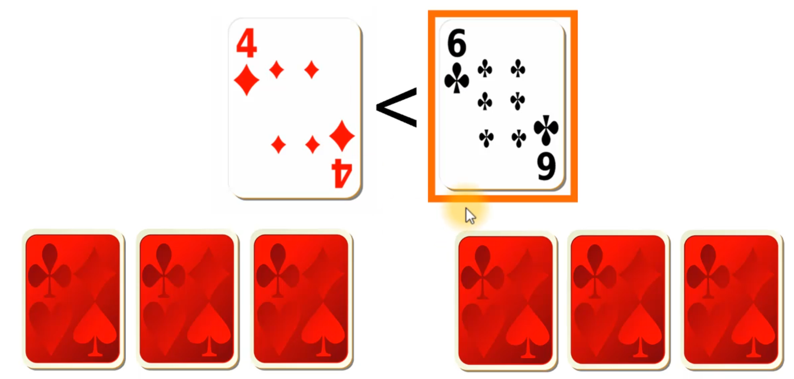

# Python-Programming-using-OOPS
## Dice Game Project
### General Requirements:
- The game should have two players: a human player and a computer player. Both should
have the same functionality.
- Both players will start with a counter of 10.
- Each player will have a particular die during the entire game.
- Both players will roll their corresponding die (once per round).
- The values of the dice will be compared to determine who wins the round. The player
with the highest value wins the round.
- If the two values are equal, then there is a tie and there is no winner for that round. The
counters are not modified.
- The counter of the player who wins a round will be decremented by 1.
- The counter of the player who loses a round will be incremented by 1.
- The counter will determine who wins the game. The player whose counter reaches the
value 0 first wins the game.

### Specific Requirements:
- Interactivity
  - Before the human player rolls the die, he/she should be prompted to press any key to start the round.
- Rolling the dice
  - When a player rolls the dice, the result should be a random integer between 1 and 6 (inclusive).
- Messages
  - The game should show a descriptive message:
    - When the game starts.
    - When a new round starts.
    - When the game ends. This message should mention who won the game.
  - The game should display messages to:
    - Show the value of each die after the players roll the dice.
    - Mention the winner of the round or if there was a tie.
    - Show both counters when a round ends.

**Die**
- Each die should have:
  - A value.
    - This value should be either None (if the die has not been rolled yet) or a random integer between 1 and 6 (inclusive).
    - This attribute should not be changed outside the class. The change should be handled internally.
- Each die should be able to:
  - Roll
    - Generate a random integer between 1 and 6 (inclusive) and assign it to the value attribute.

**Player**
- Each player should have the following attributes:
  - A Die instance.
  - A Boolean value (True/False) to indicate if the player is a human or the computer.
  - A counter. The initial value should be 10.
- Each player should be able to:
  - Increment the value of the counter by 1.
  - Decrement the value of the counter by 1.
  - Roll the die.

**DiceGame**
- This class will represent a dice game.
- Each instance of the game should have the following attributes:
  - A human player instance.
  - A computer player instance.
    - This will create a relationship between these classes. A DiceGame “has a” human player and a computer player.
  - Each instance of the game should be able to:
    - Start the game (play)
      - This method will start the game logic. It should show a welcome message and create the endless loop that will continue the game until a counter has reached the value 0.
    - Start a round (play round)
      - This method should handle the main round logic. It should welcome the player to the round, roll the dice, determine the winner and loser of the round, update the counters accordingly, and show the values of the counters.
    - Determine when the game is over and stop the game.
      - The game should end when the counter of either one of the players hasreached the value 0.
      - A descriptive message should be printed before the game ends.

## Tic-Tac-Toe Game Project
**Game Rules**
- In Tic-Tac-Toe, two players try to fill a row,  a column, the diagonal, or the antidiagonal of a 3x3 game board.
- This will be our game board: 
| 1 | 2 | 3 | 
| 4 | 5 | 6 | 
| 7 | 8 | 9 | 
The user will enter an integer from 1 to 9 (inclusive) to select the position on the board.
- On each turn, each player will select a particular position on the board and his/her marker will be added to that position.
- We will have a human player playing against the computer player, which will select a random position.
- If the player selects a position that is already taken, he/she loses the turn.
- When a row,  a column, the diagonal, or the antidiagonal is full with the player's markers, the game is over and that players wins the game.
- If the board is full but none of the players has won the game, then there is a tie.
- When the game is over, we will ask the user if he/she would like to continue playing. We will take user input and start a new round if the player chooses to continue the game.

## War Card Game
### Requirements

================================================================================ 
This is a general overview of the project requirements for the first four classes that we will implement.

- There are two players to play this game - Human v/s Computer
- When the game starts, each player receives 26 cards.
- Each player takes the top card from their deck.
- The player who drew the cards with the highest value (suits are ignored), wins the round.
- If the cards have same value, the war starts.
- Both players take three cards from the top of their deck, and they place them facing down, so they will be hidden. They will also play one additional card facing up. And we will make comparison based on the cards that are facing up. The player with the card of highest value wins the round. And the winner takes all the cards that were drawn by both the players. 
- The winner puts the cards at the bottom of his or her deck.
- If there's a tie, the process continues until one of the player wins the round.
- If one of the player wins all the cards from the deck, the game stops and the player wins.

**🔹 The Suit Class**
- The instances of this class shall have two instance attributes: description and symbol.
- description can be either: "clubs", "diamonds", "hearts", or "spades".
- symbol can be either: ♣, ♦, ♥, or ♠.
- The instance attributes shall be read-only attributes (they should only have getters).
- The class shall have a class attribute that maps suit descriptions to their corresponding symbols (this should be a dictionary).

**🔸 The Card Class**
- The instances of this class shall have two instance attributes: suit and value.
- suit must be an instance of the Suit class.
- The instance attributes shall be read-only attributes (they should only have getters).
- The class shall have a class attribute that maps the values of the special cards to their written descriptions (11 to "Jack", 12 to "Queen", 13 to "King", and 14 to "Ace"). This should be a dictionary.
- The class shall have two methods: show and is_special.
- The show method shall display the value, suit, and symbol of the suit of the card. If the card is special, this should be the written description (e.g. "Jack") instead of the value.
- The is_special method shall return True if the value of the card is greater than or equal to 11 and False otherwise.

**🔹 The Deck Class**
- The instances of this class shall have one instance attribute: cards. This attribute shall be non-public and it shall contain a list of instances of the Card class (these are the cards that belong to the deck).
- The deck shall have a property called size, which corresponds to the length of the list of cards in the deck.
- The user of the Deck class shall be able to choose if the deck is initially empty or not when the deck instance is created.
- The class shall have four methods: build, show, shuffle, draw, and add.
- The build method shall build the deck by creating 52 card instances with numbers from 2 to 14 (inclusive) for each one of the four possible suits.
- The show method shall iterate over the list of card instances and call their show method to show the description of each card.
- The shuffle method shall shuffle the deck (the list of cards in the deck) by calling the shuffle function from the random module. (please refer to the section on import statements if you are unfamiliar with import statements).
- The draw method shall return and remove the last card in the list of cards in the deck (this represents removing it from the top of the deck).
- The add method shall insert a new card object to the beginning of the list of cards in the deck (this represents removing it from the bottom of the deck).

**🔸 The Player Class**
- The instances of this class shall have three instance attributes: name, deck, and is_computer.
- name shall be a string.
- deck shall be an instance of the Deck class.
- is_computer shall be either True or False.
- name shall be a public attribute and deck and is_computer shall be non-public read-only attributes.
- The class shall have four methods: has_empty_deck, draw_card, and add_card.
- The has_empty_deck method shall return True if the size of the player's deck is 0. Else, it shall return False.
- The draw_card method shall draw a card from the player's deck if the deck is not empty and return it.
- The add_card method shall add a card to the bottom of the player's deck.